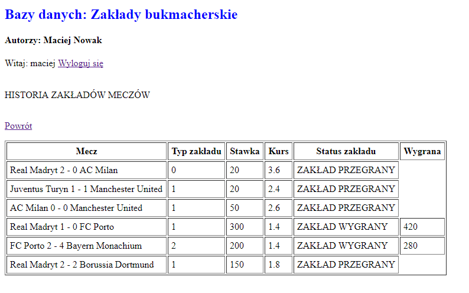
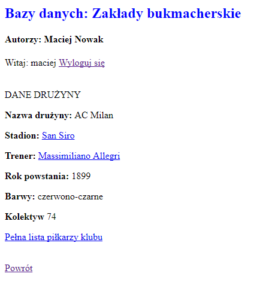
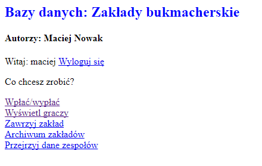
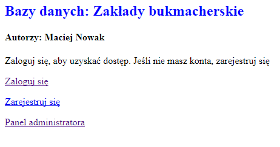

# Betting-Database-App
Football betting database app. Created at the University as the project within Database classes in 2013. The purpose of this project was to learn adapt some database and their features into choosen project. So this app isn't focues on the UI or functionality of the app.

## Functionality
- creating and managing users
- managing teams, players and all content from database by admin panel
- take a bets (result of the match, shooters or champion of the league)
- shows history of your bets
- shows matches results
- shows teams, players, coaches, stadiums details

## How it works?
At first you must run SQL queries from sql folder at choosen server. Queries contains database structure and the sample data of the teams. After that put PHP scripts into server. At voaile! You can just use it. From admin panel (nick: admin, password: admin)  you can random schedule and results of the every single round. From the user panel you can take a choosen bets.

## Screenshots
   
